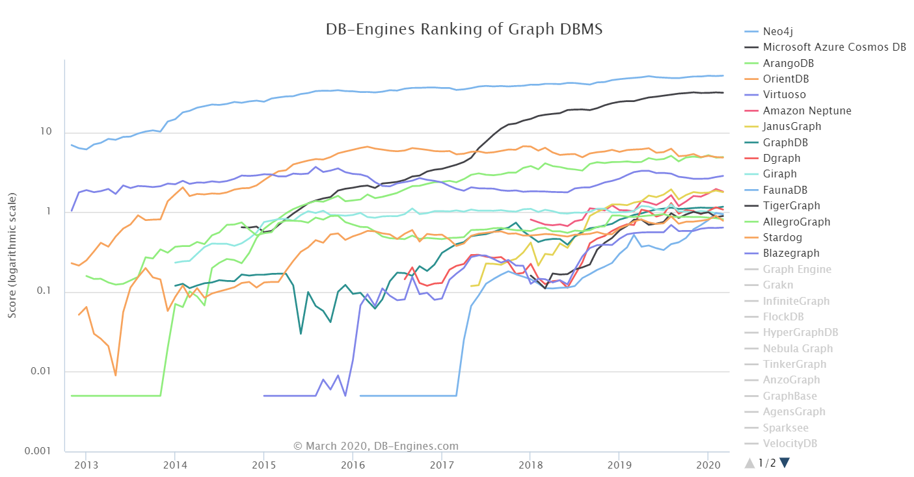
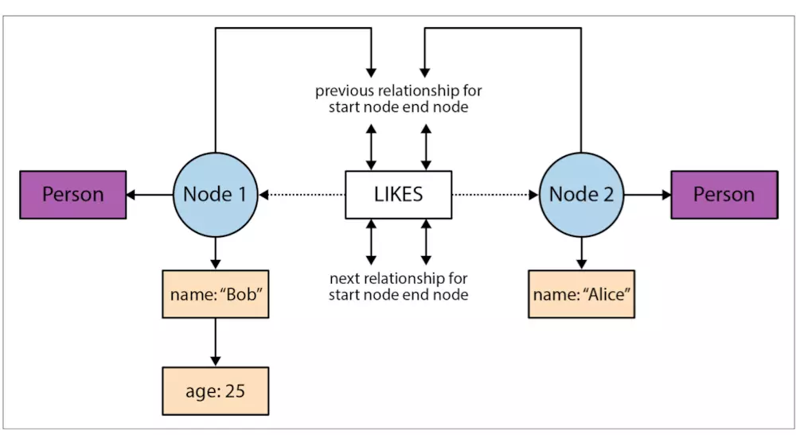
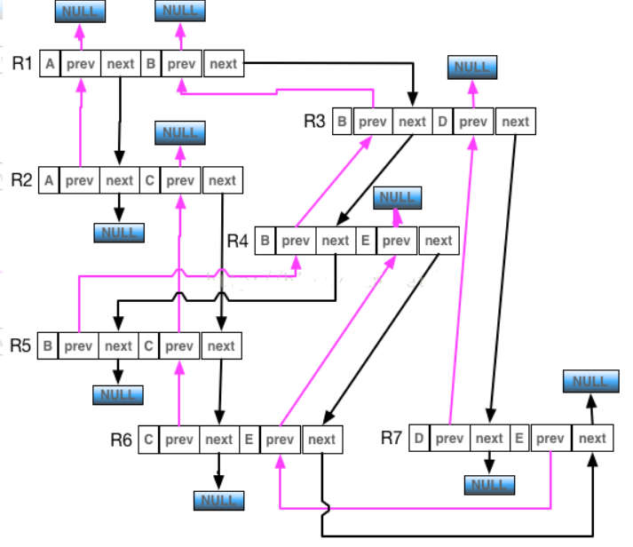

# 调研报告

<!-- TOC -->

- [小组成员](#%E5%B0%8F%E7%BB%84%E6%88%90%E5%91%98)
- [项目概述](#%E9%A1%B9%E7%9B%AE%E6%A6%82%E8%BF%B0)
- [项目背景](#%E9%A1%B9%E7%9B%AE%E8%83%8C%E6%99%AF)
    - [文件系统](#%E6%96%87%E4%BB%B6%E7%B3%BB%E7%BB%9F)
    - [数据库](#%E6%95%B0%E6%8D%AE%E5%BA%93)
- [立项依据](#%E7%AB%8B%E9%A1%B9%E4%BE%9D%E6%8D%AE)
    - [Neo4j](#neo4j)
    - [文件的自然属性](#%E6%96%87%E4%BB%B6%E7%9A%84%E8%87%AA%E7%84%B6%E5%B1%9E%E6%80%A7)
    - [模糊搜索](#%E6%A8%A1%E7%B3%8A%E6%90%9C%E7%B4%A2)
- [前瞻性/重要性分析](#%E5%89%8D%E7%9E%BB%E6%80%A7%E9%87%8D%E8%A6%81%E6%80%A7%E5%88%86%E6%9E%90)
    - [文件系统的智能化](#%E6%96%87%E4%BB%B6%E7%B3%BB%E7%BB%9F%E7%9A%84%E6%99%BA%E8%83%BD%E5%8C%96)
    - [发掘利用文件的自然属性](#%E5%8F%91%E6%8E%98%E5%88%A9%E7%94%A8%E6%96%87%E4%BB%B6%E7%9A%84%E8%87%AA%E7%84%B6%E5%B1%9E%E6%80%A7)
    - [图数据库的开发](#%E5%9B%BE%E6%95%B0%E6%8D%AE%E5%BA%93%E7%9A%84%E5%BC%80%E5%8F%91)
    - [高可扩展性](#%E9%AB%98%E5%8F%AF%E6%89%A9%E5%B1%95%E6%80%A7)
- [相关工作](#%E7%9B%B8%E5%85%B3%E5%B7%A5%E4%BD%9C)
    - [数据库文件系统](#%E6%95%B0%E6%8D%AE%E5%BA%93%E6%96%87%E4%BB%B6%E7%B3%BB%E7%BB%9F)
    - [图文件系统](#%E5%9B%BE%E6%96%87%E4%BB%B6%E7%B3%BB%E7%BB%9F)
- [参考文献](#%E5%8F%82%E8%80%83%E6%96%87%E7%8C%AE)

<!-- /TOC -->

## 小组成员
- 高楚晴（组长）
- 王幸美
- 王章瀚
- 万嘉诚
- 黄致远

## 项目概述
在信息大爆炸的时代，文件系统与数据库高度成熟，有很多方法可以帮助用户完成高效的文件读写，节省时间空间成本，但对几乎所有文件系统，用户在写入新文件时，都必须要考虑这个文件存储的逻辑位置以备未来使用，可人类总会遗忘，或许现在你正有着某个文件被遗忘在某个角落。从文件系统的角度来说，这无疑会损耗存储空间，降低索引效率，我们不希望出现这种情况。然后一种朴素的想法迸发出来，文件系统是否可以帮助用户找到他/她想要的？

其实现在已经存在了某种类似的解决思路，即macOS的Spotlight，其用一个索引程序搜寻磁盘上的文件并建立索引，这将消耗数百mb的空间，同时因为其与文件系统本身分离，需要频繁地搜寻有什么东西发生改变，消耗CPU资源，而且最重要的一点是，文件在不同PC之间转移时，这个索引不随之移动，所以对于另外一部PC，这个索引是无意义的。

这显然不是我们想要的，因而要做的更好，我们必须向文件系统进军。如果文件系统能够理解文件的自然属性（比如识别某部电影的名称导演主演等），并依据其与不同的文件建立联系，那么文件系统自然可以帮助用户找到自己想要的东西，这便是DBFS（Database File System）。而图索引又是处理文件间关系的好手，于是本次大作业的选题自此敲定，基于图数据库的着重人与文件系统交互的GDBFS（Graph Database File System）。

## 项目背景

### 文件系统
文件系统提供在存储介质上组织数据的一种方式方法。其功能包括：管理和调度文件的存储空间，提供文件的逻辑结构、物理结构和存储方法;实现文件从标识到实际地址的映射，实现文件的控制操作和存取操作，实现文件信息的共享并提供可靠的文件保密和保护措施，提供文件的安全措施。

#### DBFS
DBFS是一种新类型文件系统，最早由Onne Gorter在他的硕士论文中开发，现在是一个sf.net项目。事实上，与其称DBFS为文件系统，不如称它为文档系统。它的设计焦点集中于用户，目标是，使得用户的文件管理更加轻松。它将查找文件的责任放在了计算机上，而用户不必记忆文件储存的位置。然后DBFS实际上并不存储文件，而是在基于基础层次结构的文件系统上保存对文件的引用。 GUI部分在KDE中实现，在其中替换了所有基于层次结构的文件访问。这给人的印象是没有层次结构，但是对于应用程序而言，什么都没有改变，打开文件和保存文件对话框具有相同的API。
> API（Application Programming Interface，应用程序接口）是一些预先定义的函数，或指软件系统不同组成部分衔接的约定。目的是提供应用程序与开发人员基于某软件或硬件得以访问一组例程的能力，而又无需访问原码，或理解内部工作机制的细节。

#### 层次模型
###### 数据结构
数据库系统中最早出现的数据模型，层次数据库系统采用层次模型作为数据的组织方式。它采用**树形结构**来表示各类实体以及实体间的联系。 

这种结构允许两种类型的数据之间一对多的关系。这种结构非常有效地描述了现实世界中的许多关系：配方，目录，段落/段落的顺序，任何嵌套和排序的信息。

此层次结构用作存储中记录的物理顺序。记录访问是通过使用指针与顺序访问相结合的方式在数据结构中向下导航来完成的。因此，如果没有为每个记录提供完整路径（与向上链接和排序字段相对），则对于某些数据库操作而言，层次结构效率很低。通过在基本物理层次结构上施加附加的逻辑层次结构，可以在更高的IMS版本中弥补这些限制。
###### 优点
- 数据结构比较简单清晰
- 因为记录之间的联系用有向边表示，这种联系在DBMS中通常使用指针实现，查询效率高
- 提供了良好的完整性支持。进行插入操作时，如果没有对应的双亲结点就不能插入它的子女结点值。进行删除操作时，如果删除双亲结点，则相应的子女结点值也将被同时删除 
###### 缺点
- 现实世界中很多联系是非层次性的，它不适用于结点之间具有多对多联系； 如果结点之间具有多对多联系，不再适合使用层次模型表示。如果一个子女结点确实具有多个双亲结点，使用层次结构模型表示的时候就会出现大量的冗余，且操作复杂 
- 查询子女结点必须通过双亲结点
- 由于结构严密，层次命令趋于程序化。

#### 网状模型
网状数据模型的典型代表是DBTG（CODASYL）系统。 

利用它的流行DBMS产品是Cincom Systems的Total和Cullinet的IDMS。 IDMS获得了可观的客户群。在1980年代，除原始工具和语言外，它还采用了关系模型和SQL。

大多数对象数据库（于1990年代发明）使用导航概念来提供跨对象网络的快速导航，通常使用对象标识符作为指向相关对象的“智能”指针。例如，Objectivity / DB实现了可以跨越数据库的一对一，一对多，多对一和多对多命名关系。许多对象数据库还支持SQL，结合了两种模型的优势。
###### 数据结构
 满足以下两个条件的基本层次联系的集合为网状模型

- 允许一个以上的结点无双亲；
- 一个结点可以有多于一个的双亲。

备注：层次模型实际上是网状模型的一个特例。 

集合由循环链接列表组成，其中一种记录类型（集合所有者或父记录）在每个圈子中出现一次，而第二种记录类型（下属或子项）在每个圈子中可以出现多次。这样，可以在任何两个记录类型之间建立层次结构，例如，类型A是B的所有者。同时，可以定义另一个集合，其中B是A的所有者。因此，所有集合都包括一个通用的有向图（所有权定义方向）或网络结构。对记录的访问可以是顺序的（通常是每种记录类型），也可以通过循环链接列表中的导航来访问。
###### 优点
- 能够更为直接地描述现实世界，如一个结点可以有多个双亲，结点直接可以有多种联系；
- 具有良好的性能，存取效率较高 
- 网络模型能够比分层模型更有效地表示数据冗余，并且从祖先节点到后代的路径可能不止一个。
- 网络模型的操作具有导航性：程序保持当前位置，并通过遵循记录参与的关系从一个记录导航到另一个记录。还可以通过提供键值来定位记录
- 通常通过直接寻址磁盘上记录位置的指针来实现设置关系。这提供了出色的检索性能
###### 缺点
- 结构比较复杂，随应用环境的扩大，数据库的结构就变得越来越复杂，不利于最终用户掌握；
- 网状模型的数据定义语言和数据管理语言复杂 ，并且要嵌入某一种高级语言（C、COBOL）中，用户不容易掌握和使用；
- 由于记录之间的联系是通过存取路径实现的，应用程序在访问数据时必须选择适当的存取路径，因此用户必须了解系统结构的细节，加重了编写应用程序的负担。
- 以数据库加载和重组之类的操作为代价。

#### 关系模型
最重要的一种数据模型 
###### 数据结构
一些术语

- 关系：一个关系对应通常说的一张表；
- 元组：表中的一行即为一个元组；
- 属性：表中的一列即为一个属性，给每一个属性起一个名称即属性名；
- 码：也称为码键，表中的某个属性组，它可以唯一确定一个元组；
- 域：一组具有相同数据类型的值的集合。属性的取值范围来自某个域；
- 分量：元组中的一个属性值。
- 关系模式：对关系的描述，一搬表示为：关系名（属性1，属性2，…，属性n）

关系模型要求关系必须规范化的，关系必须满足一定的规范条件，这些规范条件中最基本的一条就是，关系的每一个分量必须是一个不可分的数据项，也就是说，不允许表中还有表。 
###### 优点
- 建立在严格的数学概念的基础上；
- 概念单一，无论实体还是实体之间的联系都是用关系来表示。对数据的检索和更新结构也是关系（也就是我们常说的表） 所以数据结构简单清晰，用户易懂易用。 
- 它的存取路径对用户透明，从而具有更高的独立性、更好的安全保密性，简化了程序员的工作个数据库开发建立的工作 
###### 缺点
- 存取路径的隐蔽导致查询效率不如格式化数据模型（即层次和网状）
- 由于存取路径对用户是透明的，查询效率往往不如格式化数据模型。
- 为了提高系统性能，数据库管理系统必须对用户的查询请求进行优化

### 数据库

#### 数据库发展的关键节点
1. 1962年，数据库（Database）一词最早流行于加利福尼亚州（硅谷所在地）一些系统研发公司的技术备忘录中。
2. 1969年，美国国防部召开的数据系统语言会议（Conference on Data Systems Languages，CODASYL）发布了一份“DBTG（Database Task Group）报告”，标志网状数据库系统进入标准化进程。
3. 1970年，IBM公司研究员Edgar Frank Codd发表了题为“A Relational Model of Data for Large Shared Data Banks”（译为“大型共享数据库的数据关系模型”）的论文，这篇论文提出了关系模型的概念，奠定了关系模型的理论基础，他本人被誉为“关系数据库之父”，并于1981年获得了有“计算机界的诺贝尔奖”之称的“图灵奖”。
4. 1984年，天睿公司（Terodata Corporation）发布第一个MPP（Massive Parallel Processor，大规模并行处理）分布式数据库专用平台，或称为无共享架构（Sharing Nothing Architecture），有效提升了系统整体性能。
5. 1986年，首款面向对象数据库GemStone/S出现。
6. 2003年，MarkLogic公司发布第一款NoSQL（Not Only SQL，泛指非关系型的数据库）数据库解决方案，XML数据库。
7. 2007年，Neo4j公司推出第一款商用NoSQL图数据库，高效支持数据之间的复杂关系分析。
8. 2015年，大数据、云计算技术得到广大企业和各国政府的青睐，技术和平台上突飞猛进，比如VoltDB、Spark、Drill等，单是Apache基金会就发布超过25个数据工程项目。

#### 图数据库
图数据库类似于1970年代的网络模型数据库，两者都代表通用图，但是网络模型数据库的抽象级别较低，并且缺乏在边缘链上的轻松遍历。

使用图结构进行语义查询的数据库，其中语义节点，边和属性用于表示和存储数据。系统的关键概念是图形（或边或关系）。该图将存储中的数据项与节点和边的集合相关联，边代表节点之间的关系。这些关系允许将存储中的数据直接链接在一起，并且在许多情况下，可以通过一项操作来检索它们。图形数据库将数据之间的关系作为优先级。在图形数据库中查询关系的速度很快，因为它们永久存储在数据库本身中。关系可以使用图形数据库直观地可视化，从而使其对于高度互连的数据很有用。
##### 存储机制

有些依赖关系引擎，并将图形数据“存储”在表中（尽管表是逻辑元素，因此此方法在图形数据库，图形数据库管理系统和数据所在的物理设备之间强加了另一个抽象层次实际存储）。

其他人则使用键值存储或面向文档的数据库进行存储，从而使其固有地具有NoSQL结构。大多数基于非关系存储引擎的图形数据库还添加了标签或属性的概念，这些标签或属性本质上是具有指向另一个文档的指针的关系。这允许对数据元素进行分类，以方便整体检索。

从图形数据库检索数据需要使用SQL以外的查询语言，而SQL是为关系系统中的数据处理而设计的，因此无法“优雅地”处理遍历图形。截至2017年，还没有像SQL关系数据库那样普遍采用单一图查询语言，并且存在各种各样的系统，大多数情况下都与一种产品紧密相关。已经进行了一些标准化工作，从而导致了诸如Gremlin，SPARQL和Cypher的多供应商查询语言。除了具有查询语言接口之外，还可以通过应用程序编程接口（API）访问某些图形数据库。

##### 常用图数据库

###### Neo4j

开源，支持ACID，具有用于企业部署的高可用性集群，并附带基于Web的管理工具，包括完整事务支持和可视节点链接图浏览器；可以使用其内置的REST Web API接口从大多数编程语言访问，以及使用官方驱动程序的专有Bolt协议。

###### ArangoDB

ArangoDB是一个开放源代码的本地多模型数据库，旨在将数据本地存储为键值对，图形和JSON文档，可以使用一种声明性查询语言-AQL进行访问。借助ArangoDB，您可以构建高性能应用程序，并在全部范围内使用所有三个数据模型进行水平扩展。开发人员希望针对他们的用例使用正确的数据模型和访问模式。 

###### NebulaGraph

一个开源的分布式图数据库。作为唯一能够存储万亿个带属性的节点和边的在线图数据库，Nebula Graph 不仅能够在高并发场景下满足毫秒级的低时延查询要求，而且能够提供极高的服务可用性和数据安全性。

###### OrientDB

OrientDB是一个用Java编写的开源NoSQL 数据库管理系统。它是一个多模型数据库，支持图形，文档，键/值和对象模型，但是关系的管理与图形数据库中的记录之间具有直接连接一样。它支持无模式，全模式和模式混合模式。它具有基于用户和角色的强大安全性分析系统，并支持使用Gremlin以及扩展用于图遍历的SQL进行查询。OrientDB使用几种基于B树和可扩展哈希，最后一个称为“哈希索引”，有计划实现基于LSM树和分形树索引的索引。每个记录都有Surrogate键，该键指示记录在Array列表内的位置，记录之间的链接存储为记录位置的单个值存储在引荐来源网站内，或者存储为记录位置的B树（所谓的记录ID或RID），从而允许一对多关系的快速遍历（具有O（1）复杂度）和新链接的快速添加/删除。

###### JanusGraph

开源、可扩展、在Linux基金会下的分布式图数据库；支持各种存储后端（Cassandra，HBase，Bigtable，BerkeleyDB）；[13] 通过与大数据平台（Spark、Giraph、Hadoop）的集成支持全局图数据分析、报告和ETL；通过外部索引存储支持地理、数字范围和全文检索（ElasticSearch、Solr、Lucene）。

##### 常用图数据库流行度比较



数据来源：[DB-ENGINES](https://db-engines.com/en/ranking/graph+dbms)

#### 关系型数据库vs图数据库
从1980s以来，关系型数据库处于绝对地位，它的设计之初是为了处理纸质表格以及表格化结构，试图对这种实际中的特殊联系进行建模。但是随着时间推移，暴露出一些无法解决的问题，讽刺的是特别就是在数据建模方面，以及大数据量和多服务器之上进行水平伸缩方面，与此同时，互联网也产生了新的趋势。在应对这些方面时，关系型数据库产生了更多不适用性。从而导致大量新项目的出现，它们被统称为NoSQL（Not Only SQL）数据库。

NoSQL中的图数据库从最近十年的表现来看已经成为关注度最高，也是发展趋势最明显的数据库类型。下图展示了db-engines.com对最近三年来所有数据库种类发展趋势的分析结果。


在关系型数据中，关联关系通常以外键存在；在其他NoSQL数据库中，关联关系通常以键值对存在；而在图数据库中，这些数据天然以关系形式存在。

在大数据量和复杂的关系场景下，关系型数据库的表现并不会很好。除此，还存在业务数据和外键数据混杂、外键约束增加额外成本、稀疏表的空值需要额外检查等问题。 而对于社交关系查询，多度SQL语句十分复杂，而查询过程的复杂度也变得很高、查询效率开始恶化。


而图的关系，能自然形成路径。查询图或者遍历图都涉及路径查询。由于从根本上说，数据模型是面向路径的，多数基于路径的图数据库的操作都与数据模型本身呈现高度一致性，所以图数据库极为高效。 

利用RDBMS和Neo4j进行多度关系查询得到对比结果如下：


 可见，在支持到5度关系查询时，涉及到的结果集约为80万条，Neo4j依然能够在2秒左右的时间返回，而此时，RDBMS甚至都无法正常完成查询 。

## 立项依据
本项目旨在利用neo4j搭建图数据库，采用多种方式确立文件的自然属性构建索引

### Neo4j

Neo4j是一个高性能的NOSQL图形数据库，它将结构化数据存储在图上而不是表中。它是一个嵌入式的、基于磁盘的、具备完全的事务特性的Java持久化高性能引擎，该引擎具有成熟数据库的所有特性。我们计划使用neo4j完成图数据库的搭建。

<div align=center>
      
</div> 

#### 存储结构

在一个图中包含两种基本的数据类型：Nodes和 Relationships。

Node和Relationship 的 Property 是用一个 Key-Value 的双向列表来保存的。Nodes通过Relationships所定义的关系相连起来，形成关系型网络结构。Node 的 Relatsionship 是用一个双向列表来保存的，通过关系，可以方便的找到关系的 from-to Node. 



> 一个可能的搜索过程是：对于给定的一个 node record，可以通过 id 进行简单的偏移计算得到 node，然后通过 relation_id 定位到 relation record，然后得到 end node id，通过偏移计算得到 node

 Node 节点保存第1个属性和第1个关系ID。不使用schema，因此可以满足任何形式的需求。

关系储存的示意图如下。   



从示意图可以看出，从 Node-B 开始，可以通过关系的 next 指针，遍历Node-B 的所有关系，然后可以到达与其有关系的第1层Nodes,在通过遍历第1层Nodes的关系，可以达到第2层Nodes

#### 查询语言
Neo4j提供名为Cypher的查询语言，对比命令式语言如Java和脚本语言如Gremlin和JRuby，它的焦点在于从图中如何找回，而不是怎么去做。这使得在不对用户公布的实现细节里关心的是怎么优化查询。通过一系列不同的方法和建立于确定的实践为表达查询而激发的。许多关键字如like和order by是受SQL的启发。模式匹配的表达式来自于SPARQL。正则表达式匹配实现实用Scala programming language语言。
> SPARQL即SPARQL Protocol and RDF Query Language的递归缩写，专门用于访问和操作RDF数据。查询是基于图匹配的思想，把上述的查询与RDF图进行匹配，找到符合该匹配模式的所有子图，最后得到变量的值。

Cypher的语法提供了一种视觉和逻辑的方式来匹配图中节点和关系的模式。它是一种声明性的，基于SQL的语言，用于使用ASCII-Art语法描述图形中的视觉模式。 查询语法中主要包括以下几个方面：    
- START：在图中的开始点，通过元素的ID或所以查找获得。
- MATCH：图形的匹配模式，束缚于开始点。
- WHERE：过滤条件。
- RETURN：返回所需要的。   

对应上文提到的neo4j的存储结构，我们可以用如下形式描述图的结构。
``` cypher
(n:label{name:"Vic"})   //节点具有特定的标签和name属性，且属性值是"Vic"
[r:type{name:"Friend"}] //关系的类型是type，关系具有属性name，且属性值是“Friend”
(a)-[r]->(b)            //节点a和b之间存在有向的关系r
(a)-[*N..M]->(b)        //表示路径长最小值N最大值M，起始节点是a，终止节点是b；  
```

#### 优势
与许多图数据库不同，Neo4j是一个原生的图数据库引擎，可以使用图结构的自然伸展特性来设计免索引邻近节点遍历的查询算法，即图的遍历算法设计。图的遍历并不受数据量的大小所影响，因为邻近查询始终查找的是有限的局部数据，不会对整个数据库进行搜索。所以，Neo4j具有非常高效的查询性能，相比于RDBMS可以提高数倍乃至数十倍的查询速度。而且查询速度不会因数据量的增长而下降。同时RDBMS因为不可避免地使用了一些范式设计，所以在查询时如果需要表示一些复杂的关系，势必会构造很多连接，从而形成很多复杂的运算。  

### 文件的自然属性
能够合理地描述文件的自然属性是GDBFS的基础，找到如何描述文件的方法是必不可少的，然而研究具体如何获取自然属性在定位上并不属于操作系统的范畴，不是我们的主要工作，在工作量上也太过繁重，我们预备采用互联网上公开提供使用的或开源的内容来帮助GDBFS完成文件自然属性的识别。因为网络上相关工作是针对不同文件类型进行处理的，我们也针对不同文件类型准备了如下备选方案

#### 文档
###### 讯飞开放平台
讯飞开放平台是一个开放的智能交互技术服务平台，开发者可以使用语音合成、语音识别、语音唤醒、语义理解、人脸识别等多项服务。在文档处理方面具体到提供了多种形式的文字识别，词法分析，依存句法分析，语义角色标注，语义依存分析，情感分析和关键词提取的功能。
###### ParallelDots
ParallelDots针对中文文档处理的功能尚有欠缺，但是对于英文文档处理功能相当全面，包括情感分析（Sentiment Analysis），情绪分析（Emotion Analysis），关键词提取，意图分析，潜在语义分析，文本分类，辱骂分容分类器（Abusive Content Classifier），讽刺检测（Sarcasm Detection）。
###### LinguaKit
LinguaKit包括情感分析，语言分析，关键词提取(一次性支持最多5000字)，词组提取，专用名词识别等
###### cortical.io
cortical.io作为一个付费平台，提供了一些免费服务，包括关键词提取，文档比较，歧义条款（Disambiguate Terms）
###### doc2vec
Doc2Vec 或者叫做 paragraph2vec, sentence embeddings，是一种非监督式算法，可以获得 sentences/paragraphs/documents 的向量表达，是 word2vec 的拓展。学出来的向量可以通过计算距离来找 sentences/paragraphs/documents 之间的相似性，可以用于文本聚类，对于有标签的数据，还可以用监督学习的方法进行文本分类，例如经典的情感分析问题。

#### 音频
对于音乐一类的音频，有很多公开平台做到了很好的识别正确率与识别速度，但是对于日常生活中的音频文件，自然属性的处理变得麻烦起来，我们预定对日常音频文件做声纹识别，语音转写并分析语义等多种方式综合处理
###### 讯飞开放平台
讯飞开放平台在语音识别方面具体到提供了语音听写，语音转写，声纹识别，性别年龄识别和歌曲识别的功能。
###### 音乐播放器的音乐识别
类似网易云音乐，QQ音乐等多款音乐播放器拥有音乐识别的功能
###### 翻译软件的语音转写
类似有道词典，谷歌翻译，微软翻译等翻译软件因为用户需求已经形成了强大的语音转写功能。

#### 图像与视频
对于图像，我们直接采用图像识别提取自然属性，对于视频文件，我们采取先提取关键帧再图像识别的方式，故将这两者方面一起介绍。
##### 图像
###### Clarifai
提供相似图片查找服务，能够识别图中多个要素，并按置信度排序，api可申请使用。  
###### Waston Recognition(IBM)
提供高度可定制平台，能够分析来自场景、物体、面部、颜色、食物、品牌及其他内容的图像，可以同时识别多个要素并按置信度排序，提供免费的api。  
###### Imagga
Imagga的图像识别工具提供了多种自动选项，用于根据类别，颜色，标签或自定义输入对图像进行分类，组织和显示。能够识别图中多个要素，并按置信度排序，提供免费的api。   
###### 百度识图
百度识图的成功率相比前面几个个能并不高，但是具有百度百科的天然优势，在识别成功后，会把相应的百度百科（如果有的话）展示出来
###### whatanime
whatanime拥有强大的影视作品识别能力，可以识别出图片具体出现在影视作品的第几季第几集（或者哪部电影），并给出相应的百科。  
##### 视频关键帧提取
###### FFmpeg
FFmpeg是一套可以用来记录、转换数字音频、视频，并能将其转化为流的开源计算机程序。采用LGPL或GPL许可证。它提供了录制、转换以及流化音视频的完整解决方案。它包含了非常先进的音频/视频编解码库libavcodec，为了保证高可移植性和编解码质量，libavcodec里很多code都是从头开发的。

FFmpeg在Linux平台下开发，但它同样也可以在其它操作系统环境中编译运行，包括Windows、Mac OS X等。这个项目最早由Fabrice Bellard发起，2004年至2015年间由Michael Niedermayer主要负责维护。许多FFmpeg的开发人员都来自MPlayer项目，而且当前FFmpeg也是放在MPlayer项目组的服务器上。项目的名称来自MPEG视频编码标准，前面的"FF"代表"Fast Forward"。

因为FFmpeg在关键帧提取方面非常优秀，我们并没有提供相应的关键帧提取的备选方案。

### 模糊搜索
在用户主动搜索文件的过程中，我们需要对用户的需求与现有自然属性匹配，这就用到了模糊匹配，我们准备了以下备选方案

#### word2vec
利用word2vec提取语义向量，在多维空间内寻找最近的一个（或多个）自然属性点来实现模糊搜索。

#### Approximate String Matching
最常见的几种近似字符串搜索有:
1. Inserttion: co*t->co**a**t, cot->co**a**t
2. Deletion: co**a**t->co*t, co**a**t->cot
3. Substitution: co**a**t->co**s**t
4. Transposition: co**st**->co**ts**

#### FuzzyWuzzy-模糊字符串匹配工具
FuzzyWuzzy是一个简单易用的模糊字符串匹配工具包。它主要支持Python语言，并能在Java，Rust，C++等常用高级语言上运行。
其主要原理是根据Levenshtein Distance 算法计算两个序列之间的差异。
> Levenshtein Distance 算法，又叫 Edit Distance 算法，是指两个字符串之间，由一个转成另一个所需的最少编辑操作次数。许可的编辑操作包括将一个字符替换成另一个字符，插入一个字符，删除一个字符。一般来说，编辑距离越小，两个串的相似度越大。

## 前瞻性/重要性分析

### 文件系统的智能化
智能生活概念目前是科技领域的热点，涉及到智能家居、智能出行、智慧城市等一系列相关研究领域。智能这一概念出现在了生活的方方面面，然而对于文件系统本身，或者说操作系统的智能化却鲜有关注，然而一个智能的文件系统却是至关重要的，它不仅可以避免用户遗忘带来的损失，还可以极大地改善用户体验，堪比文件系统中的自动驾驶，GDBFS拥有显而易见地前瞻性和重要性

### 发掘利用文件的自然属性
发掘利用文件的自然属性，为构建文件索引提供了一个不同于以往添加tag的新思路，通过文件的自然属性构建的索引具有优秀的稳定性以及泛用性，是对未知领域的探索。

### 图数据库的开发
图天生关注对象和对象之间的关系，可以高效插入大量数据，查询关联数据，与以文件的自然属性为基础构建的GDBFS高度契合，但其应用范围并不广泛，主要应用于社交网络和推荐引擎。GDBFS创新地将图数据库与DBFS相结合，拓宽了图数据库的应用范围，推动了DBFS地发展。

### 高可扩展性
第三方可以自行添加关联算法与相似算法，用户可以选择使用的算法，使得GDBFS实际上可以构建基于不同逻辑的索引，也有利于GDBFS构建更加真实的自然属性索引，对于一个开源项目的开发和进步有重要意义。

## 相关工作

### 数据库文件系统

#### Oracle数据库
Oracle数据库通常用于存储与数据库应⽤密切相关的文件，包括 CAD，医学图像，发票图像，文档等。应用程序使用SQL标准数据类型 BLOB（和CLOB）将文件存储在数据库中。与传统文件系统相比，Oracle 数据库提供了更好的安全性，可用性，鲁棒性，事务和可扩展性。当文件存储在数据库中时，它们将被备份，使用Data Guard同步到灾难恢复站点，并与数据库中的关系数据一起恢复。

在Oracle Database 中，Oracle引入了Oracle SecureFiles LOB为文件提供高性能存储，与传统文件系统的性能相当。 SecureFiles LOB支持对文件进行压缩，重复数据删除和加密的高级功能。 由于SecureFiles LOB保持与BLOB（和CLOB）的向后兼容性，所以针对 BLOB编写的应用程序继续透明地使用SecureFiles LOB，即使用前面提到的功能。 

#### sf.net项目
DBFS最先由University of Twente的Onne Gorter进行开发，现已成为sf.net项目。如今KDE的core中已经加入了DBFS，打开文件和保存文件界面已经被DBFS替代，然而其底层始终是传统的层次化文件系统，只是向用户呈现出了DBFS的表象。

sf.net的这个项目最开始是为了实现使用户能够通过文件的各种特征来找到文件的便捷性。例如，当用户需要找到一个文件，那么这个DBFS将向用户收集该文件的信息，其中包括但不限于：这个文件上个月被编辑过吗？这个文件是否是一个文字文档？这个文件是否属于某个特定的项目？有了这样一些问题，DBFS的搜索范围逐渐减小，最终确定在一些文件上，甚至能直接定位到用户想要的文件。

相较于传统的文件系统使用的目录结构，DBFS中更多地使用关键词。并且在DBFS中，这样的一些关键词更像是目录的超集。

此外, sf.net项目中的DBFS还有几个比较重要的设计。首先是，DBFS不存储系统文件，也就是它不存储libraries，或字体文件等。主要原因是这些都不是文档，不是日常生活中会去查找的，也不太方便在DBFS中存储。其次，一些应该在一起的文件，应该视为一个文档。举例来说，一个音乐文件，它的对应的歌词文件应该和这个音乐文件绑定在一起作为一个文档；或者一部电影有两个部分，这两个部分虽然是两个文件，但在DBFS中也应该被视为一个文档。

### 图文件系统

#### GFS: 具有语义特性的图文件系统
University of Pisa的Daniele Di Sarli建立了一种图文件系统(GFS)。主要的思想是将基于路径的层级定位代替以语义。换句话说，路径不再被视为目录有序列表，而是被视为一个集合。这样一来，要取得一个文件，就不再需要记住属性顺序。此外，它也改进了SIL(Semantic instead of Location)需要得到所有tags才能找到一个文件的缺陷。

而这个GFS设计中，作者认为并不能完全抛弃系统文件夹这样的传统特性。此外，为了减轻用户手工标记的工作量，文件系统必须提供分配多个标记以及同时标记多个文件的自然方法。GFS可以看作是一个标准的文件系统，在其任何一个位置，用户都可以创建**标准目录**或者**语义目录**。

最关键的地方是语义目录的管理方式：语义空间可以建模为一个直接连接的**Ego Graph**，其中入口点是中心，标签是其他节点。一旦创建了一个新标记，就创建了从入口点到入口点的两条边。此外，新标记与路径中到入口点的所有标记进行双重链接。在语义空间中创建标准目录将导致退出此空间。这使语义空间与标准层次结构交替成为可能。这种机制的一个使用示例可能是这样的情况:用户希望自己的主目录是语义目录，但他们也希望音乐有一个单独的名称空间，工作文档有一个名称空间，日志文件和下载有一个标准行为(见图)。
<div align=center>
      
</div> 

#### QMDS: 文件系统元数据管理服务(支持基于图数据模型的查询语言)
这篇论文里，作者看到了POSIX的不足——元数据中用户唯一能够定义的只有文件名；它的定位是基于层级结构的,应用程序要找到文件需要完整的文件名等。作者将原有的树形结构融入一个图结构中，并采用一些ranking算法能得到很好的搜索性能。
下图是一个示例：
<div align=center>
      
</div> 

## 参考文献
- https://en.wikipedia.org/wiki/OrientDB

- [http://dbfs.sourceforge.net/](http://dbfs.sourceforge.net/)  
- [GFS: a Graph-based File System Enhanced with Semantic Features](https://www.iit.cnr.it/sites/default/files/gfs.pdf)  
- [QMDS: A File System Metadata Management Service Supporting a Graph Data Model-based Query Language]()  
- [FuzzyWuzzy：简单易用的字符串模糊匹配工具](https://zhuanlan.zhihu.com/p/53135935)
- https://cloud.tencent.com/developer/article/1387673

+ [Neo4j图数据库简介和底层原理](https://www.cnblogs.com/Renyi-Fan/p/7833274.html)
+ [https://neo4j.com/docs/](https://neo4j.com/docs/)
